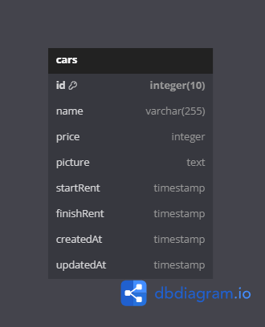

### SYNRGY 7 BINAR CHALLENGE 5 RESTFUL API FSW 2 FADHILAH FARHAN

### INSTRUCTION
1. Clone project into your local
2. Change directory to this project folder `cd 24001118-synrgy7-fad-bcr-ch5`
3. Use command `npm install`
4. Next step use command `npm run build` to compile TypeScript into JavaScript
5. Make sure copy `.env.example` file to `.env` and fill up the correct value of your PostgreSQL connection and cloudinary connection!
6. Run command `npx knex migrate:up` to create table via migration
7. Run command `npx knex seed:run` to fill up table with data seeder!
8. For final step run command `npm run start`
9. Make sure database and cloudinary already connected to your project

### ENDPOINT LIST

| API ENDPOINT | METHOD   |     DESCRIPTION        |
|--------------|----------|------------------------|
| `/cars`      |   `GET`  | Get All Data Cars      |
| `/cars/:id`  |   `GET`  | Get By Id Data Car     |
| `/cars/`     |  `POST`  | Post Data Cars         |
| `/cars/:id`  |   `PUT`  | Update Data Car By Id  |
| `/cars/:id`  | `DELETE` | Delete Data Car By Id  |

### ERD (Entity Relationship Diagram)
